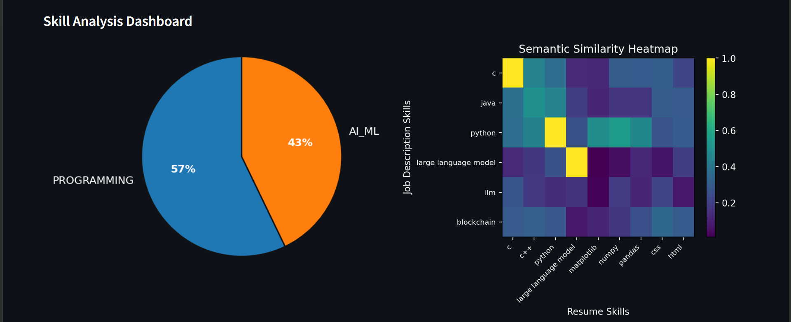

# AI Resume Intelligence System  
### Hybrid AI-powered Resume vs Job Description Matching Engine


---

## Overview

Modern Applicant Tracking Systems (ATS) rely heavily on keyword matching.  
This often leads to:

- Strong candidates being rejected due to wording differences  
- Relevant skills being ignored if phrased differently  
- No intelligent explanation of skill gaps  

This project introduces a **Hybrid Resume Intelligence Engine** that combines structured matching with semantic similarity to create a smarter, explainable evaluation system.

---

## Dashboard Preview

<p align="center">
  
</p>

---

## Core Idea — Hybrid Fusion Engine

Traditional systems only check for exact keyword matches.

This system evaluates resumes using:

1. **Exact Skill Matching (Structured Matching)**
2. **Related Skill Detection (Semantic Similarity using embeddings)**
3. **Hybrid Score Fusion**
4. **Category-based Skill Coverage Analysis**
5. **Priority-based Skill Gap Detection**
6. **Interactive Dashboard Visualization**

This creates a more intelligent and fair evaluation process.

---

## System Architecture

<p align="center">
  
</p>

---

## Tech Stack

- Python
- Streamlit
- Sentence Transformers
- PyTorch
- Matplotlib
- Modular `src/` architecture

---

## Key Features

- Upload Resume (PDF)
- Paste Job Description
- Toggle Semantic Matching
- Exact Skill Match %
- Related Skill Match %
- Overall Fit Score
- Dark-themed Dashboard
- Category-wise Pie Chart
- Semantic Similarity Heatmap
- Priority-based Skill Gap Analysis
- Explainable Score Breakdown

---

## How To Run Locally

Clone the repository:

```bash
git clone https://github.com/Purva1307/ai-resume-intelligence-system.git
cd ai-resume-intelligence-system
```

Install dependencies:

```bash
pip install -r requirements.txt
```

Run the app:

```bash
streamlit run app_streamlit.py
```

---

## Live Deployment

The live version of this application will be available shortly on Streamlit Cloud.

---

## Future Improvements

- Multi-resume comparison
- Recruiter analytics dashboard
- Skill recommendation engine
- LLM-powered resume improvement suggestions
- Cloud-based deployment API
- ATS score benchmarking

---

## Why This Project Matters

This system demonstrates:

- Applied NLP
- Embedding-based semantic intelligence
- Hybrid scoring architecture
- Explainable AI principles
- Dashboard-driven product thinking

It bridges the gap between academic AI models and real-world hiring systems.

---

## Author

**Purva Mishra**  
B.Tech CSE  
AI/ML Enthusiast  

---
